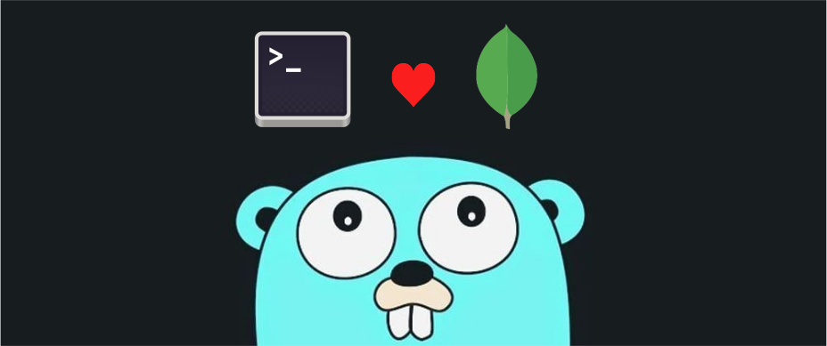

# mon-go: A Simple MongoDB CLI Shell

`mon-go` is a basic command-line interface (CLI) shell for interacting with MongoDB databases, built using Go and the BubbleTea TUI framework. It allows you to navigate databases, collections, and documents, similar to a traditional shell in a Unix-like environment.

## Usage

Run the program directly using `go run`:

```bash
go run main.go [connection_string]
```

## Commands
*   **`cd`:** Navigate between databases and collections.
*   **`ls`:** List databases, collections, or documents.
    *   Lists up to 5 entries by default.
    * Displays a "results truncated" message when limit is passed.
    *   `-la` flag: Lists all entries, without truncation.
```sh
mon-go (/) > # command                             

admin
config
```

## Installation

1.  **Prerequisites:**
    *   Go (version 1.18 or later recommended)
    *   MongoDB server running (either locally or remotely)


2. **Build (Optional):**

    ```bash
    go build -o mon-go
    ```
    This creates an executable file named `mon-go` (or `mon-go.exe` on Windows).
